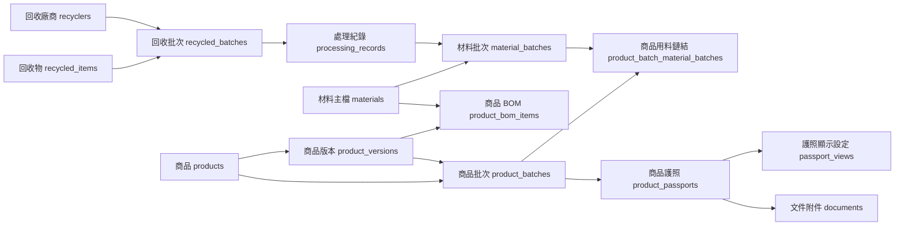

# 產品與功能規格

## 1. 產品定位

SENWEI DPP 平台是一個品牌網站與商品護照查詢系統。前台服務消費者與合作對象查詢商品、批次與追溯資訊；後台提供品牌管理者維護回收、材料、商品與商品護照資料，形成可對外揭露的 DPP 資訊鏈。

## 2. 使用者角色

| 角色 | 目的 | 主要操作 |
| --- | --- | --- |
| 消費者 | 了解品牌、商品與護照資訊 | 瀏覽首頁/商品頁、輸入商品批次號、查看 consumer 版本護照 |
| 通路/合作夥伴 | 查看較完整的商品與批次資訊 | 以 `view=b2b` 查看護照資料 |
| 稽核/驗證人員 | 檢視追溯來源、文件、批次鏈 | 以 `view=audit` 查看護照資料 |
| 後台管理者 | 維護 DPP 與前台內容 | 管理回收、材料、商品、護照、文件、前台 Hero/流程 |

注意：目前程式中的 `src/middlewares/authMiddleware.js` 是 placeholder，後台尚未實作登入與角色授權。

## 3. 前台功能規格

| 頁面 | 路由 | 功能 |
| --- | --- | --- |
| 首頁 | `GET /` | 顯示品牌 Hero、三個重點資訊、品牌理念、商品展示、能量運作流程 |
| 關於我們 | `GET /about` | 顯示可後台維護的關於頁 Hero 與品牌理念 |
| 商品頁 | `GET /product` | 顯示單一主打商品頁內容與商品護照入口 |
| 商品護照查詢 | `GET /passport?batchNo=...` | 以商品批次號查詢已發布商品護照，顯示查詢結果與詳情入口 |
| 商品列表 | `GET /products` | 列出 `is_public = 1` 且 `status = active` 的商品 |
| 商品詳情 | `GET /products/:slug` | 顯示商品主檔、最新啟用版本與公開 BOM 材料 |
| 批次查詢 | `GET/POST /lookup/batch` | 以商品批次號查詢護照，可指定 `consumer`、`b2b`、`audit` |
| 護照詳情 | `GET /passports/:passportCode?view=consumer` | 顯示商品、材料、回收來源、處理紀錄、文件與 QR Code |

### 前台顯示規則

- 商品列表只顯示公開且啟用商品：`products.is_public = 1`、`products.status = active`。
- 護照查詢只顯示已發布護照：`product_passports.status = published`。
- 商品詳情優先取最新啟用版本；若沒有啟用版本，退回最新版本。
- 商品詳情只顯示 `product_bom_items.public_visible = 1` 的材料。
- 護照顯示內容由 `passport_views.config_json` 控制；若無設定，使用 `src/config/passportViews.js` 的預設設定。
- 文件附件目前只查詢 `target_type = product_passport` 且 `visibility_level` 等於目前 view type 的文件。

## 4. 後台功能規格

後台入口為 `GET /admin`，資料管理採通用 CRUD 架構，清單路由為 `/admin/<resource>`。

| 模組 | Resource | 功能重點 |
| --- | --- | --- |
| 回收廠商 | `recyclers` | 管理廠商資料、證號、公開/內部備註；系統自動產生 `RC-YYYYMMDD-XXXXXX` |
| 回收物類型 | `recycled-items` | 管理回收物名稱、分類、狀態；系統自動產生 `RI-YYYYMMDD-XXXXXX` |
| 回收批次 | `recycled-batches` | 建立回收批次、數量、來源、檢測摘要；系統自動產生 `RB-YYYYMMDD-XXXXXX` |
| 處理紀錄 | `processing-records` | 登錄回收批次使用量與產出材料批次；系統自動產生處理單號與材料批次號 |
| 材料主檔 | `materials` | 管理材料名稱、分類、公開描述與內部備註；系統自動產生 `MAT-YYYYMMDD-XXXXXX` |
| 材料批次 | `material-batches` | 管理由處理紀錄產出的材料批次與檢測摘要 |
| 商品主檔 | `products` | 管理商品資料、SKU、slug、公開狀態、護照啟用 |
| 商品版本 | `product-versions` | 管理商品版本、生效日期與狀態 |
| 商品 BOM | `product-bom` | 設定商品版本使用哪些材料、材料角色與公開顯示順序 |
| 商品批次 | `product-batches` | 管理商品生產批次與有效日期 |
| 商品用料鏈結 | `product-batch-material-batches` | 將商品批次連結到實際使用的材料批次 |
| 文件附件 | `documents` | 管理文件與目標資料的關聯、文件類型與可見層級 |
| 商品護照 | `product-passports` | 將商品、版本、批次綁定為公開護照代碼 |
| 護照顯示設定 | `passport-views` | 管理 consumer/b2b/audit 各版本 JSON 顯示設定 |
| DPP 匯出紀錄 | `dpp-exports` | 記錄 JSON/CSV/Excel/PDF 匯出結果 |
| 前台內容 | `home-hero`, `home-flow-steps`, `about-hero`, `product-hero`, `passport-hero` | 管理前台 Hero 與首頁流程內容 |

## 5. 核心資料流程

### 5.1 DPP 追溯鏈

### 5.2 後台建議建立順序

1. 建立回收廠商與回收物類型。
2. 建立回收批次，填入收料數量、來源、檢測摘要。
3. 建立處理紀錄，填寫本次使用量，並建立一筆或多筆產出材料。
4. 建立商品主檔與商品版本。
5. 建立商品 BOM，設定商品版本會公開顯示的材料。
6. 建立商品批次。
7. 建立商品用料鏈結，將商品批次連到實際材料批次。
8. 建立商品護照並設為 `published`。
9. 視需求建立 `passport_views` 與文件附件。

## 6. 狀態與數量規則

### 回收批次處理狀態

`recycled_batches.processed_status` 由處理紀錄數量自動更新：

| 狀態 | 條件 |
| --- | --- |
| `pending` | 已使用量小於等於 0 |
| `partial` | 已使用量大於 0 且尚未達回收批次總量 |
| `processed` | 已使用量大於等於回收批次總量 |

`processing_records.status = cancelled` 的紀錄不列入已使用量。

### 處理紀錄建立/更新規則

- 必須選擇來源回收批次。
- `quantity_used` 必須大於 0。
- 本次使用量不可超過來源回收批次剩餘量。
- 每筆產出材料若有 `quantity_produced`，必須選擇既有材料或輸入新材料名稱。
- 更新處理紀錄時，會刪除並重建該處理紀錄的材料批次產出。

## 7. 驗收重點

- 前台 `/passport?batchNo=<商品批次號>` 能查到 `published` 護照並進入詳情。
- 護照詳情能正確顯示商品、版本、商品批次、材料批次、回收廠商、處理單號與文件。
- 後台建立處理紀錄時，回收批次剩餘數量與 `processed_status` 會正確更新。
- 後台刪除回收批次時，關聯處理紀錄、材料批次、商品用料鏈結與文件索引會依程式邏輯清理。
- 圖片欄位選檔後會先上傳到 `/admin/api/media`，再由表單儲存圖片路徑。

## 8. 待補強項目

- 後台登入、session、角色權限與 CSRF 防護。
- 補上 express-validator 驗證規則與一致的錯誤回到表單機制。
- 建立 seed 範例資料，降低測試與交接成本。
- 讓商品批次、商品版本、材料批次等表單改為 select 關聯選擇，減少手填 ID 錯誤。
- 補上自動化測試，尤其是數量扣抵、追溯查詢與刪除 cascade。
- 將 DPP 匯出紀錄從手動 CRUD 擴充為實際產生 JSON/CSV/Excel/PDF 的操作流程。

