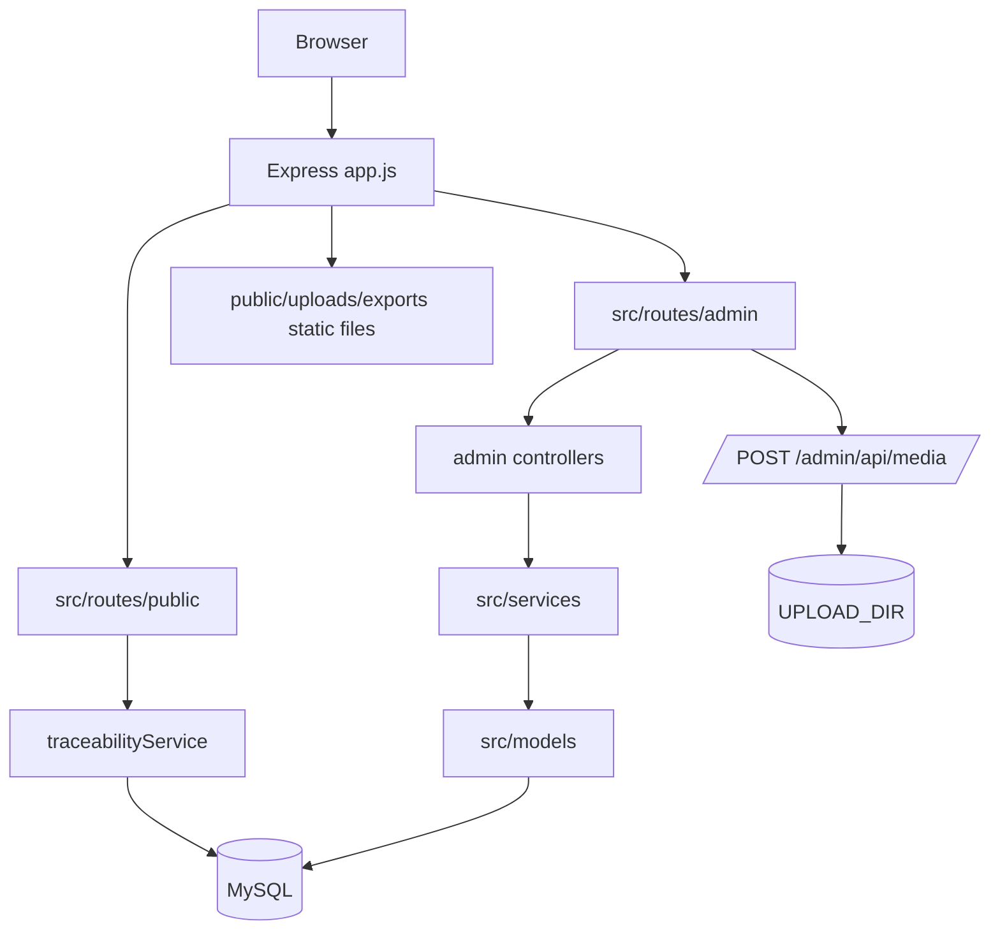
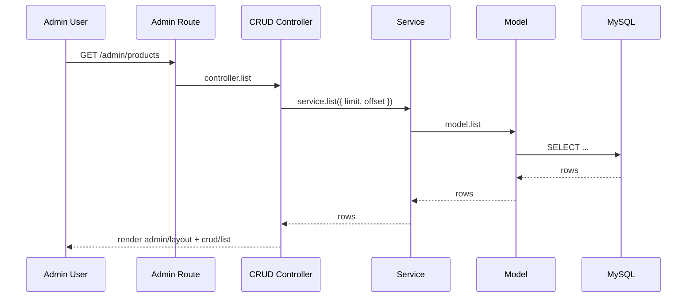
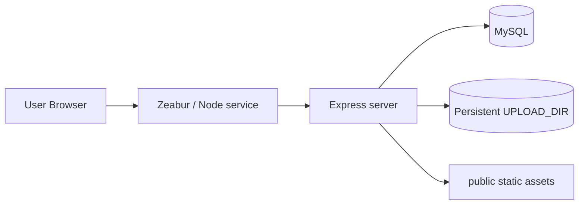

# 系統架構

## 1. 技術棧

| 類別 | 技術 |
| --- | --- |
| Runtime | Node.js 20+ |
| Web framework | Express 5 |
| Template | EJS |
| Database | MySQL 8 |
| DB driver | mysql2/promise |
| Form method override | method-override |
| File upload | multer |
| Validation | express-validator，目前規則大多尚未填入 |
| Frontend assets | `public/css`, `public/js`, `public/assets`, `/uploads` |

## 2. 高階架構

## 3. 啟動流程

程式入口為 `server.js`。

1. 載入 `.env` 與資料庫設定。
2. 決定 listen port：本機預設 `3000`，Zeabur 環境若未設定 `PORT` 則使用 `8080`。
3. 建立 `UPLOAD_DIR` 實體目錄。
4. 建立 Express app。
5. 執行 `ensureSchema()`：
   - 嘗試查詢 `recyclers`。
   - 若資料表不存在，執行 `scripts/migrate.js`。
   - 執行 `ensureIncrementalSchema()`，補上 `quantity_used` 與 `quantity_produced` 等增量欄位。
6. 啟動 HTTP server。

## 4. Express App 設定

`app.js` 負責組裝 application：

- 設定 EJS views：`src/views`。
- 啟用 `express.urlencoded` 與 `express.json`。
- 啟用 body/query aware 的 `methodOverride`，支援 HTML form 用 POST + `_method` 送 PUT/DELETE。
- 靜態資源：
  - `/` → `public`
  - `/uploads` → `getUploadDir()`
  - `/exports` → 專案根目錄 `exports`
- 掛載路由：
  - `/` → `src/routes/public`
  - `/admin` → `src/routes/admin`
- 404 使用 `src/views/public/404.ejs`。
- 錯誤處理由 `src/middlewares/errorMiddleware.js` 負責。

## 5. 目錄分層

| 目錄 | 職責 |
| --- | --- |
| `src/routes` | 定義 HTTP 路由與 middleware 串接 |
| `src/controllers` | 接收 request、呼叫 service、render view 或 redirect |
| `src/services` | 業務邏輯、交易流程、狀態與數量規則 |
| `src/models` | 資料表 CRUD 封裝 |
| `src/views` | EJS 前後台頁面 |
| `src/database/migrations` | MySQL schema migration |
| `src/config` | 環境變數、DB pool、upload dir、passport view config |
| `src/middlewares` | upload、validation、error、auth placeholder |
| `src/utils` | 匯出、QR code、schema 補強、表單清理等工具 |
| `public` | 前台靜態 CSS/JS/assets |
| `uploads` | 本機預設上傳檔案 |
| `exports` | DPP 匯出檔案公開目錄 |
| `scripts` | migration、seed、Zeabur env 輔助工具 |

## 6. 後台 CRUD 架構

多數後台功能使用共同工廠：

- `src/controllers/admin/crudControllerFactory.js`
- `src/models/crudModelFactory.js`
- `src/services/crudServiceFactory.js`

典型流程：

每個 admin controller 定義：

- `resourceSlug`：後台 URL resource。
- `title`：頁面標題。
- `listFields`：清單欄位。
- `formFields`：表單欄位，可為陣列或 async function。
- `preprocess`：寫入前資料整理。

## 7. 特殊業務服務

### traceabilityService

`src/services/traceabilityService.js` 是前台 DPP 查詢核心：

- `listPublicProducts()`：公開商品列表。
- `getProductDetailBySlug(slug)`：商品詳情與公開 BOM。
- `lookupByBatchNo({ batchNo })`：由商品批次號找到已發布護照。
- `getPassportDetailByCode(passportCode, viewType)`：組合護照詳情、材料、追溯鏈與文件。

### processingRecordWorkflowService

`src/services/processingRecordWorkflowService.js` 是處理紀錄的交易核心：

- 建立/更新處理紀錄。
- 驗證來源回收批次剩餘量。
- 解析表單的 `material_lines`。
- 必要時建立新材料。
- 產生材料批次。
- 同步回收批次處理狀態。

這個服務使用 MySQL transaction 與 `FOR UPDATE`，避免扣量競態問題。

### recycledBatchQuantityService

`src/services/recycledBatchQuantityService.js` 負責：

- 計算回收批次已用數量。
- 計算剩餘可處理數量。
- 依數量同步 `pending`、`partial`、`processed`。

## 8. 圖片上傳架構

後台圖片欄位不是直接把 multipart form 送到 CRUD route，而是前端選檔後：

1. `src/views/admin/crud/form.ejs` 以 `fetch` POST 到 `/admin/api/media`。
2. `src/routes/admin/mediaApiRoutes.js` 使用 `singleImageUploadApi('file')`。
3. multer 存檔到 `UPLOAD_DIR`。
4. API 回傳 `/uploads/<filename>`。
5. 表單將圖片路徑寫入一般文字欄位，再送 CRUD 儲存。

優點是一般 CRUD 表單維持 urlencoded，PUT/DELETE method override 較穩定。

## 9. 部署架構

建議部署設定：

- Node service 設定 `PORT`；若平台未注入，程式在 Zeabur 會 fallback `8080`。
- MySQL 連線可使用 `MYSQL_URI`、`MYSQL_CONNECTION_STRING` 或拆分的 `DB_*` 變數。
- 上傳檔案請設定持久化目錄，例如 `UPLOAD_DIR=/data/uploads`，避免重新部署後檔案遺失。

## 10. 安全與風險

目前需要優先補強：

- `/admin` 尚未真正驗證登入。
- 無 CSRF 防護，後台表單有跨站請求風險。
- validator 規則多為空，錯誤多靠資料庫與 service throw。
- 文件與圖片 URL 直接由後台欄位輸入，需要後續加入路徑/副檔名/可見性檢查。
- `passport_views.config_json` 可控制前台顯示，但目前沒有 schema validation。

