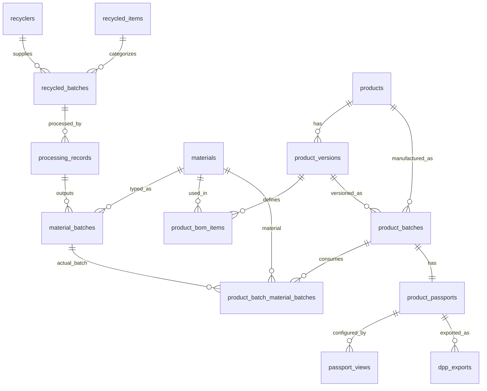

# 資料模型與追溯鏈

## 1. 資料表總覽

| 類別 | 資料表 | 說明 |
| --- | --- | --- |
| 回收來源 | `recyclers` | 回收廠商主檔 |
| 回收來源 | `recycled_items` | 回收物類型主檔 |
| 回收來源 | `recycled_batches` | 回收批次、數量、來源、檢測摘要 |
| 處理製程 | `processing_records` | 回收批次處理紀錄與使用量 |
| 材料 | `materials` | 材料主檔 |
| 材料 | `material_batches` | 處理後產出的材料批次 |
| 商品 | `products` | 商品主檔 |
| 商品 | `product_versions` | 商品版本 |
| 商品 | `product_bom_items` | 商品版本的材料組成 |
| 商品 | `product_batches` | 商品生產批次 |
| 商品 | `product_batch_material_batches` | 商品批次實際使用哪些材料批次 |
| 護照 | `product_passports` | 商品批次對應的一本商品護照 |
| 護照 | `passport_views` | consumer/b2b/audit 顯示設定 |
| 文件/匯出 | `documents` | 附件文件索引 |
| 文件/匯出 | `dpp_exports` | DPP 匯出紀錄 |
| 前台內容 | `home_hero`, `home_flow_steps`, `about_hero`, `product_hero`, `passport_hero` | 前台可編輯內容 |

## 2. 核心 ERD



`documents` 採 polymorphic association，以 `target_type` 與 `target_id` 綁定不同資料表。

## 3. 主要資料表欄位

### recyclers

| 欄位 | 說明 |
| --- | --- |
| `name` | 廠商名稱 |
| `code` | 廠商代碼，唯一，系統產生 |
| `tax_id`, `contact_person`, `phone`, `email`, `address`, `website` | 基本聯絡資訊 |
| `certificate_no`, `certificate_file` | 回收證號與附件 |
| `public_note`, `internal_note` | 對外與內部備註 |
| `status` | `active`, `inactive` |

### recycled_items

| 欄位 | 說明 |
| --- | --- |
| `name` | 回收物名稱 |
| `code` | 回收物代碼，唯一，系統產生 |
| `category` | 回收物分類 |
| `description` | 說明 |
| `status` | `active`, `inactive` |

### recycled_batches

| 欄位 | 說明 |
| --- | --- |
| `recycled_item_id` | 回收物類型 |
| `recycler_id` | 回收廠商 |
| `batch_no` | 回收批次號，唯一，系統產生 |
| `received_date` | 收料日期 |
| `quantity`, `unit` | 進貨數量與單位 |
| `source_location` | 來源地 |
| `trace_code`, `trace_url` | 外部追溯編號與網址 |
| `certificate_no` | 回收證號 |
| `test_report_summary` | 檢測報告摘要 |
| `processed_status` | `pending`, `partial`, `processed` |
| `public_visible` | 是否公開 |

### processing_records

| 欄位 | 說明 |
| --- | --- |
| `process_no` | 處理單號，唯一，系統產生 |
| `recycled_batch_id` | 來源回收批次 |
| `quantity_used` | 本次使用回收物數量 |
| `process_method` | 處理方式 |
| `process_date` | 處理日期時間，語意為 Asia/Taipei 牆上時間 |
| `result_note` | 結果備註 |
| `status` | `draft`, `completed`, `cancelled` |

### materials

| 欄位 | 說明 |
| --- | --- |
| `name` | 材料名稱 |
| `code` | 材料代碼，唯一，系統產生 |
| `category` | 材料分類 |
| `description` | 內部說明 |
| `is_recycled_material` | 是否回收再生成 |
| `public_description` | 前台可見描述 |
| `internal_note` | 內部備註 |
| `status` | `active`, `inactive` |

### material_batches

| 欄位 | 說明 |
| --- | --- |
| `material_id` | 材料主檔 |
| `batch_no` | 材料批次號，唯一，系統產生 |
| `processing_record_id` | 對應處理紀錄 |
| `source_recycled_batch_id` | 來源回收批次 |
| `quantity_produced` | 產出數量 |
| `produced_date`, `expiry_date` | 製成與有效日期 |
| `test_report_summary` | 檢測報告摘要 |
| `attachment_file` | 附件路徑 |
| `status` | `active`, `inactive`, `used_up` |

### products

| 欄位 | 說明 |
| --- | --- |
| `name` | 商品名稱 |
| `sku` | SKU，唯一 |
| `category` | 商品分類 |
| `short_description` | 商品簡述 |
| `usage_instruction`, `caution`, `specification` | 使用方式、注意事項、規格 |
| `main_image` | 商品主圖 |
| `is_public` | 是否公開於前台 |
| `passport_enabled` | 是否啟用商品護照 |
| `slug` | 前台商品詳情 URL slug，唯一 |
| `status` | `draft`, `active`, `inactive` |

### product_versions

| 欄位 | 說明 |
| --- | --- |
| `product_id` | 商品 |
| `version_no` | 版本號 |
| `version_name` | 版本名稱 |
| `effective_date` | 生效日期 |
| `status` | `draft`, `active`, `inactive` |

同一商品下 `version_no` 不可重複。

### product_bom_items

| 欄位 | 說明 |
| --- | --- |
| `product_version_id` | 商品版本 |
| `material_id` | 材料 |
| `material_role` | 材料角色 |
| `sort_order` | 顯示順序 |
| `public_visible` | 是否公開 |
| `note` | 備註 |

同一商品版本不可重複設定同一材料。

### product_batches

| 欄位 | 說明 |
| --- | --- |
| `product_id` | 商品 |
| `product_version_id` | 商品版本 |
| `batch_no` | 商品批次號，唯一 |
| `manufacture_date`, `expiry_date` | 製造與有效日期 |
| `status` | `draft`, `active`, `inactive` |

### product_batch_material_batches

| 欄位 | 說明 |
| --- | --- |
| `product_batch_id` | 商品批次 |
| `material_id` | 材料 |
| `material_batch_id` | 實際使用的材料批次 |
| `note` | 備註 |

同一商品批次、材料、材料批次組合不可重複。

### product_passports

| 欄位 | 說明 |
| --- | --- |
| `product_id` | 商品 |
| `product_version_id` | 商品版本 |
| `product_batch_id` | 商品批次 |
| `passport_code` | 護照代碼，唯一 |
| `public_url` | 公開網址 |
| `qr_code_path` | QR Code 圖片路徑 |
| `status` | `draft`, `published`, `archived` |

一個商品批次只能綁定一本商品護照。

### passport_views

| 欄位 | 說明 |
| --- | --- |
| `product_passport_id` | 商品護照 |
| `view_type` | `consumer`, `b2b`, `audit` |
| `config_json` | 顯示設定 JSON |

同一護照與同一 view type 只能有一筆設定。

### documents

| 欄位 | 說明 |
| --- | --- |
| `target_type` | 文件綁定類型，可為 NULL（未綁定） |
| `target_id` | 文件綁定對象 ID，可為 NULL（未綁定） |
| `document_type` | 文件類型 |
| `title` | 文件標題 |
| `file_path` | 檔案路徑 |
| `summary` | 摘要 |
| `visibility_level` | `consumer`, `b2b`, `audit`, `internal` |

目前前台護照詳情顯示 `target_type = product_passport` 的所有文件，暫不依 `visibility_level` 過濾（各檢視都看得到全部文件）。

後台「商品護照」編輯頁提供文件複選：勾選的文件會改綁到該護照，取消勾選則解除綁定（target 設為 NULL）。文件建立時也可先不綁定。

## 4. 護照顯示設定

`passport_views.config_json` 目前以 `show` 物件控制區塊是否顯示，例如：

```json
{
  "version": 1,
  "show": {
    "product": {
      "name": true,
      "mainImage": true,
      "category": true,
      "shortDescription": true,
      "productVersion": true,
      "productBatchNo": true
    },
    "materials": {
      "materialList": true,
      "materialPublicDescription": true,
      "materialBatchNo": true,
      "materialRole": true
    },
    "recyclersAndTrace": {
      "recyclerName": true,
      "recyclerCertificateNo": true,
      "recycledBatchTraceCode": true,
      "traceUrl": true,
      "sourceLocation": true,
      "processingProcessNo": true
    },
    "documents": {
      "showDocumentsList": true,
      "allowDownloads": true
    },
    "qrCode": true
  }
}
```

預設值位於 `src/config/passportViews.js`。

## 5. 編號規則

| 資料 | 格式 |
| --- | --- |
| 回收廠商 | `RC-YYYYMMDD-XXXXXX` |
| 回收物 | `RI-YYYYMMDD-XXXXXX` |
| 回收批次 | `RB-YYYYMMDD-XXXXXX` |
| 處理紀錄 | `PR-YYYYMMDD-XXXXXX` |
| 材料 | `MAT-YYYYMMDD-XXXXXX` |
| 材料批次 | `MB-YYYYMMDD-XXXXXX` |

`XXXXXX` 是 3 bytes random hex 的大寫字串。

## 6. 刪除與關聯注意事項

- 多數資料表依資料庫外鍵限制刪除。
- `recycledBatchService.remove()` 額外處理回收批次刪除，會依序刪除：
  - 關聯的 `product_batch_material_batches`
  - 關聯材料批次的 `documents`
  - 關聯的 `material_batches`
  - 關聯處理紀錄的 `documents`
  - `processing_records`
  - 回收批次本身的 `documents`
  - `recycled_batches`
- `processingRecordWorkflowService.deleteWithCascade()` 會刪除該處理紀錄的材料批次與處理紀錄，並同步來源回收批次狀態。

刪除商品、商品版本、材料與已被引用的資料時，仍可能受到外鍵限制；後續可補上更友善的錯誤訊息與關聯檢查。

